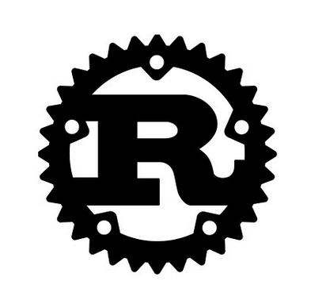

# README do respositório
texto sem formatação
__texto formatado em italico__
**texto formatado em negrito**


## Programa Olá, Mundo! escrito em Rust:
```
fn main() {
	println!("Olá, Mundo!");
}
```
[site da linguagem Rust](https://www.rust-lang.org/)

### Exemplo de lista não ordenada:
* primeiro item.
* segundo item.
* terceiro item.

### Exemplo de lista ordenada:
1. etapa 1.
	1. etapa 1.1.
1. etapa dois.
	1. etapa 2.1.
1. etapa tres.
	1. etapa 3.1.

